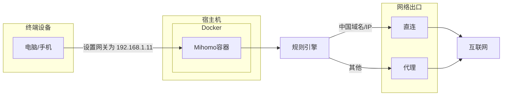

## 背景

之前尝试过基于 OpenWrt + OpenClash 搭建旁路由，但 OpenWrt 系统本身较为臃肿，且 OpenClash 配置复杂，稳定性一般。后来也关注过 Sing-box，虽然功能新颖但变动较快，稳定性有待验证。因此，决定基于 OpenClash 的核心 Mihomo，手动搭建一套精简、高效的旁路由方案。

特别是在 Vibe Coding 等 AI 辅助开发模式下，AI 需要自动全局代理，以避免手动解决 npm 包安装、Docker 镜像拉取以及调用大语言模型 API 时的连通性问题。手动开发时可能偶尔需要代理，但 AI 自动开发时对网络连通性要求极高，一个稳定可靠的旁路由方案能极大提升开发效率。

采用 Docker + Macvlan + Mihomo + TUN 的组合，相较于在 OpenWrt 上再搭建服务，具有以下优势：
- **更轻量**：无需完整的 OpenWrt 系统，仅需 Docker 容器运行 Mihomo。
- **启动更快**：容器化部署，启动和重启速度显著提升。
- **更稳定**：Mihomo 作为 Clash 核心，经过多年发展，稳定性有保障。

## 架构图



## 准备工作

1. **一台支持 Docker 的 Linux 主机**（物理机或虚拟机均可）
2. **确保系统支持 macvlan 网络驱动**（通常 Linux 内核 3.9+ 都支持）
3. **准备配置文件 `config.yaml`**（下文提供模板）

## 创建 Macvlan 网络

首先，需要创建一个 macvlan 网络，让容器能够获得独立的局域网 IP。假设你的主机网卡为 `eth0`，网段为 `192.168.1.0/24`，网关为 `192.168.1.1`。

执行以下命令创建 macvlan 网络：

```bash
docker network create -d macvlan \
  --subnet=192.168.1.0/24 \
  --gateway=192.168.1.1 \
  -o parent=eth0 \
  macnet
```

**注意**：请根据你的实际网络环境修改 `--subnet`、`--gateway` 和 `-o parent` 参数。

**macvlan 网络限制（可选）**：默认情况下，宿主机与 macvlan 容器之间无法直接通信。如果宿主机也需要使用旁路由代理，需要额外创建一个 macvlan shim 网络：
```bash
# 创建宿主机使用的 macvlan 接口
ip link add macvlan-shim link eth0 type macvlan mode bridge
ip addr add 192.168.1.10/24 dev macvlan-shim
ip link set macvlan-shim up
ip route add 192.168.1.11/32 dev macvlan-shim
```
这样宿主机就可以通过 192.168.1.10 访问容器的 192.168.1.11 了。如果宿主机不需要代理，可以跳过此步骤。

## 准备配置文件

创建一个目录用于存放配置文件，例如 `/root/mihomo`。在该目录下创建 `config.yaml` 文件。以下是一个精简的配置模板（示例配置），包含 `proxy-providers` 示例，请替换为自己的配置信息。

```yaml
# Mihomo Minimal Transparent Proxy Config
# Suitable for Docker macvlan + TUN model

# -----------------------------
# 代理配置（示例）
# -----------------------------
proxies:
  - name: "SS1"
    type: ss
    server: aaa.mangege.com  # 替换为你的代理服务器地址
    port: 443                # 替换为你的代理端口
    cipher: chacha20-ietf-poly1305
    password: "aaa"          # 替换为你的代理密码
    udp: true
    udp-over-tcp: true
    udp-over-tcp-version: 2
    ip-version: ipv4

# -----------------------------
# 代理提供者（示例）
# -----------------------------
proxy-providers:
  my-provider:
    type: http
    path: ./providers/my-provider.yaml
    url: https://example.com/provider.yaml  # 替换为你的订阅链接
    interval: 3600
    health-check:
      enable: true
      url: http://www.gstatic.com/generate_204
      interval: 300

# -----------------------------
# 基础配置
# -----------------------------
mixed-port: 7890
redir-port: 7892       # TCP 透明代理
tproxy-port: 7893      # UDP 透明代理
ipv6: true
allow-lan: true
unified-delay: false
tcp-concurrent: true

# -----------------------------
# 外部控制
# -----------------------------
external-controller: 127.0.0.1:9090
external-ui: ui
external-ui-url: "https://github.com/MetaCubeX/metacubexd/archive/refs/heads/gh-pages.zip"

# -----------------------------
# Geo 数据
# -----------------------------
geodata-mode: true
geox-url:
  geoip: "https://github.com/MetaCubeX/meta-rules-dat/releases/download/latest/geoip-lite.dat"
  geosite: "https://github.com/MetaCubeX/meta-rules-dat/releases/download/latest/geosite.dat"
  mmdb: "https://github.com/MetaCubeX/meta-rules-dat/releases/download/latest/country-lite.mmdb"
  asn: "https://github.com/MetaCubeX/meta-rules-dat/releases/download/latest/GeoLite2-ASN.mmdb"

# -----------------------------
# 其他设置
# -----------------------------
client-fingerprint: chrome

profile:
  store-selected: true
  store-fake-ip: true

sniffer:
  enable: true
  sniff:
    HTTP:
      ports: [80, 8080-8880]
      override-destination: true
    TLS:
      ports: [443, 8443]
    QUIC:
      ports: [443, 8443]
  skip-domain:
    - "Mijia Cloud"
    - "+.push.apple.com"

# -----------------------------
# TUN 设置（关键）
# -----------------------------
tun:
  enable: true
  stack: gvisor
  mtu: 1500
  dns-hijack:
    - "any:53"
    - "tcp://any:53"
  auto-route: true
  auto-redirect: true
  auto-detect-interface: true
  fake-ip-range: 198.18.0.1/16

# -----------------------------
# DNS 设置
# -----------------------------
dns:
  enable: true
  ipv6: true
  enhanced-mode: fake-ip
  fake-ip-filter:
    - "*"
    - "+.lan"
    - "+.local"
    - "+.market.xiaomi.com"
  default-nameserver:
    - tls://223.5.5.5
    - tls://223.6.6.6
  fallback:
    - tls://1.1.1.1
    - tls://8.8.8.8
  nameserver:
    - https://doh.pub/dns-query
    - https://dns.alidns.com/dns-query

# -----------------------------
# 代理组
# -----------------------------
proxy-groups:
  - name: "DEFAULT"
    type: select
    proxies: [SS1]

# -----------------------------
# 规则
# -----------------------------
rules:
  # 局域网IP直连
  - GEOIP,lan,DIRECT,no-resolve
  # 中国域名直连（通过GeoSite规则）
  - GEOSITE,CN,DIRECT
  # 中国IP直连（通过GeoIP规则）
  - GEOIP,CN,DIRECT
  # Tailscale相关域名直连（可选）
  - DOMAIN-SUFFIX,ts.net,DIRECT
  - DOMAIN-SUFFIX,tailscale.io,DIRECT
  - DOMAIN-SUFFIX,tailscale.com,DIRECT
  # 其他所有流量走代理组DEFAULT（即使用SS1代理）
  - MATCH,DEFAULT
```

### 重要提示
- 将上述配置中的代理信息（`server`、`port`、`password` 等）替换为你自己的。
- 如果使用 `proxy-providers`，请确保 `url` 指向有效的订阅链接。
- 根据需要调整 `tun`、`dns`、`rules` 等配置。
- 更多配置选项请参考 Mihomo 官方文档：
  - [配置示例](https://wiki.metacubex.one/example/conf/)
  - [完整配置说明](https://wiki.metacubex.one/config/)

## 启动容器

使用以下命令启动 Mihomo 容器：

```bash
docker run -d \
  --name mihomo \
  --restart always \
  --network macnet \
  --ip 192.168.1.11 \
  -v /root/mihomo/config.yaml:/root/.config/mihomo/config.yaml \
  metacubex/mihomo:latest
```

**注意**：
- `--ip` 参数指定容器的 IP 地址，请确保该 IP 在你的局域网网段内且未被占用。
- `-v` 参数将主机上的配置文件映射到容器内，请确保路径正确。
- `--network macnet` 使用之前创建的 macvlan 网络。

## 配置说明

- **Macvlan 网络**：使容器获得独立 IP，如同物理设备接入局域网。
- **TUN 模式**：启用 TUN 接口实现透明代理，对应用透明。
- **DNS 劫持**：通过 `dns-hijack` 劫持 DNS 查询，防止 DNS 泄露。
- **规则分流**：采用“中国站点与中国IP走直连，否则走代理”的策略。具体规则：局域网IP直连、中国域名直连（GeoSite）、中国IP直连（GeoIP）、Tailscale域名直连，其他所有流量走代理组。
- **代理组**：配置一个名为 DEFAULT 的 select 代理组，包含 SS1 代理。规则中的 MATCH,DEFAULT 将所有未匹配的流量导向此代理组，实现代理功能。
- **客户端配置**：需要在要使用旁路由的机器上手动配置静态IP和DNS服务器地址，将它们都设置为 Mihomo 容器的IP地址（如 192.168.1.11），以确保流量正确通过旁路由。
  - **Windows**：网络设置 → 更改适配器选项 → 右键以太网/WiFi → 属性 → IPv4 → 手动设置IP和DNS
  - **macOS**：系统偏好设置 → 网络 → 高级 → TCP/IP → 手动配置 → DNS → 添加 192.168.1.11
  - **Linux**：`nmcli` 或编辑 `/etc/resolv.conf`，添加 `nameserver 192.168.1.11`
- **安全性建议**：
  1. 配置文件权限：`chmod 600 /root/mihomo/config.yaml`
  2. 防火墙设置：确保 Mihomo 端口（7890、7892、7893、9090）不被外部访问
  3. 定期更新：定期更新镜像以获取安全补丁
  4. 日志监控：定期检查日志，发现异常访问
- **性能调优**：
  1. MTU 调整：在 config.yaml 的 tun 部分调整 MTU 值（通常 1500 或 1400）
  2. 连接数限制：根据服务器性能调整 `max-concurrent` 参数
  3. 缓存优化：启用 `store-selected` 和 `store-fake-ip` 以提升性能
  4. DNS 缓存：调整 DNS 缓存时间以减少查询次数

## 验证配置

配置完成后，需要验证旁路由是否工作正常。

### 基础测试
1. **检查容器状态**：
   ```bash
   docker ps | grep mihomo
   ```

2. **测试 DNS 解析**：
   ```bash
   nslookup google.com 192.168.1.11
   ```

3. **测试网络连通性**：
   ```bash
   # 从客户端 ping 网关
   ping 192.168.1.11
   
   # 从客户端测试代理
   curl -x socks5://192.168.1.11:7890 https://httpbin.org/ip
   ```

### 流量测试
1. **国内网站直连测试**：
   ```bash
   curl -I https://www.baidu.com
   ```

2. **国外网站代理测试**：
   ```bash
   curl -I https://www.google.com
   ```

3. **查看 Mihomo 日志确认分流**：
   ```bash
   docker logs mihomo -f | grep -E "DIRECT|REJECT|匹配"
   ```

### 性能测试
1. **速度测试**：
   ```bash
   # 使用 speedtest-cli 测试
   pip install speedtest-cli
   speedtest-cli --server 12345  # 替换为实际服务器ID
   ```

2. **延迟测试**：
   ```bash
   ping -c 10 192.168.1.11
   ```

## 故障排查

### 常见问题
1. **容器无法启动**：
   - 检查配置文件语法：`docker logs mihomo`
   - 确认 macvlan 网络已创建：`docker network ls`
   - 检查 IP 地址冲突：`ping 192.168.1.11`

2. **客户端无法上网**：
   - 确认客户端网关和 DNS 都设置为 `192.168.1.11`
   - 检查 Mihomo 日志：`docker logs mihomo -f`
   - 测试 DNS 解析：`nslookup google.com 192.168.1.11`

3. **速度慢或不稳定**：
   - 检查代理服务器状态
   - 调整 MTU 值（在 config.yaml 的 tun 部分修改）
   - 查看容器资源使用：`docker stats mihomo`

### 日志查看
```bash
# 查看实时日志
docker logs mihomo -f

# 查看最近100行日志
docker logs mihomo --tail 100

# 查看特定时间后的日志
docker logs mihomo --since 2026-03-25T21:00:00
```

### 配置验证
```bash
# 检查容器状态
docker ps | grep mihomo

# 检查网络连接
docker exec mihomo ping -c 3 192.168.1.1

# 检查 DNS 服务
docker exec mihomo nslookup google.com
```

## 维护

### 容器管理
1. **重启容器**：
   ```bash
   docker restart mihomo
   ```

2. **停止容器**：
   ```bash
   docker stop mihomo
   ```

3. **删除容器**：
   ```bash
   docker rm -f mihomo
   ```

### 配置更新
1. **修改配置文件**：
   ```bash
   # 编辑配置文件
   vim /root/mihomo/config.yaml
   
   # 重启容器使配置生效
   docker restart mihomo
   ```

2. **配置热重载**（如果支持）：
   ```bash
   # 通过 API 重载配置
   curl -X PUT http://127.0.0.1:9090/configs -d '{"path":"/root/.config/mihomo/config.yaml"}'
   ```

### 镜像更新
1. **拉取最新镜像**：
   ```bash
   docker pull metacubex/mihomo:latest
   ```

2. **重建容器**：
   ```bash
   # 停止并删除旧容器
   docker stop mihomo
   docker rm mihomo
   
   # 使用新镜像重新创建容器
   docker run -d \
     --name mihomo \
     --restart always \
     --network macnet \
     --ip 192.168.1.11 \
     -v /root/mihomo/config.yaml:/root/.config/mihomo/config.yaml \
     metacubex/mihomo:latest
   ```

### 备份与恢复
1. **备份配置**：
   ```bash
   # 备份配置文件
   cp /root/mihomo/config.yaml /root/mihomo/config.yaml.backup
   
   # 备份容器
   docker export mihomo > mihomo-backup.tar
   ```

2. **恢复配置**：
   ```bash
   # 恢复配置文件
   cp /root/mihomo/config.yaml.backup /root/mihomo/config.yaml
   
   # 重启容器
   docker restart mihomo
   ```

## 总结

通过 Docker + Macvlan + Mihomo + TUN 的组合，我们搭建了一个轻量、稳定且高效的旁路由方案。相比传统的 OpenWrt 方案，它更加精简，启动更快，维护也更简单。只需将终端设备的网关指向旁路由的 IP（如 `192.168.1.11`），即可享受全局代理服务。